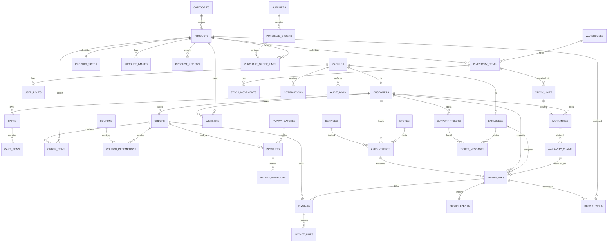

# TwinTech — Database Schema & Relationships

Reference data model for the **TwinTech Computer Sales, Inventory, Repair, Service & Payment Platform**.
The current app runs on mock data (`src/lib/mock-data.ts`); this document is the production schema those
screens map onto (PostgreSQL / Lovable Cloud conventions: `uuid` PKs, `timestamptz`, RLS on every table).

---

## 1. Domain map

| Domain | Tables |
| --- | --- |
| Identity & access | `profiles`, `user_roles`, `employees`, `audit_logs` |
| Catalog | `categories`, `products`, `product_specs`, `product_images`, `product_reviews` |
| Inventory | `warehouses`, `inventory_items`, `stock_units` (serials), `stock_movements` |
| Procurement | `suppliers`, `purchase_orders`, `purchase_order_lines` |
| Commerce | `customers`, `carts`, `cart_items`, `orders`, `order_items`, `coupons`, `coupon_redemptions`, `wishlists` |
| Billing | `invoices`, `invoice_lines`, `payments`, `payway_batches`, `payway_webhooks` |
| Service | `services`, `appointments`, `repair_jobs`, `repair_events`, `repair_parts`, `warranties`, `warranty_claims` |
| Support & content | `support_tickets`, `ticket_messages`, `notifications`, `stores`, `blog_posts`, `plans`, `reports` |

---

## 2. Entity relationship diagram



---

## 3. Table reference

Conventions: every table has `id uuid pk default gen_random_uuid()`, `created_at timestamptz default now()`,
`updated_at timestamptz`. `→` marks a foreign key.

### 3.1 Identity & access

**profiles** — one row per auth user (mirror of `auth.users`).
| Column | Type | Notes |
| --- | --- | --- |
| `id` | uuid PK | → `auth.users.id` (on delete cascade) |
| `full_name` | text | "Sokha Chan" |
| `email` | text unique | |
| `phone` | text | |
| `avatar_url` | text | |
| `locale` | text | `en`, `km` |

**user_roles** — roles live in their own table (never on `profiles`, to prevent privilege escalation).
| Column | Type | Notes |
| --- | --- | --- |
| `user_id` | uuid | → `profiles.id` |
| `role` | `app_role` enum | `owner`, `manager`, `technician`, `cashier`, `customer` |
| unique | (`user_id`,`role`) | checked via `has_role(uuid, app_role)` security-definer fn |

Permission scopes used by the UI (`src/lib/roles.ts`): `insights`, `commerce`, `payments`, `inventory`,
`service`, `people`, `settings`, `portal`.

**employees** — staff record for a profile.
`profile_id →profiles`, `employee_code` (EMP-11), `job_title`, `team` (Repairs/Warehouse/Retail),
`store_id →stores`, `rating numeric(2,1)`, `jobs_completed int`, `status` (`active`,`on_leave`,`inactive`).

**audit_logs** — append-only.
`actor_id →profiles` (nullable for `System`), `action`, `entity_type`, `entity_id`, `ip inet`,
`severity` (`info`,`warning`,`error`), `metadata jsonb`, `at timestamptz`.

### 3.2 Catalog

**categories** — `slug` unique, `name`, `parent_id →categories` (self-referencing tree), `icon`, `sort_order`.

**products**
| Column | Type | Notes |
| --- | --- | --- |
| `slug` | text unique | `tt-apex-15` |
| `sku` | text unique | `TT-APX15-2024` |
| `name`, `brand` | text | |
| `category_id` | uuid | → `categories.id` |
| `price`, `compare_at_price` | numeric(12,2) | USD |
| `badge` | text | "Best seller" |
| `blurb`, `description` | text | |
| `rating_avg` | numeric(2,1) | denormalised from `product_reviews` |
| `review_count` | int | denormalised |
| `is_active` | bool | |

**product_specs** — 1:1 with product: `cpu`, `gpu`, `ram`, `storage`, `motherboard`, `warranty_terms`, `extra jsonb`.

**product_images** — `product_id`, `url`, `alt`, `position`.

**product_reviews** — `product_id`, `customer_id`, `rating int check 1..5`, `comment`,
`status` (`pending`,`approved`,`rejected`), `moderated_by →employees`.

### 3.3 Inventory

**warehouses** — `code` (`A1`), `name` ("Phnom Penh · A1"), `store_id →stores`, `city`.

**inventory_items** — stock level per product per warehouse.
`product_id`, `warehouse_id`, `on_hand int`, `reserved int`, `reorder_point int`, `unit_cost numeric(12,2)`,
generated `status` = `out` when `on_hand = 0`, `low` when `on_hand < reorder_point`, else `healthy`.
Unique (`product_id`,`warehouse_id`).

**stock_units** — serial-level tracking (drives warranty).
`inventory_item_id`, `serial` unique, `purchase_order_line_id`, `state`
(`in_stock`,`sold`,`rma`,`scrapped`), `sold_order_item_id →order_items`, `warranty_months int`.

**stock_movements** — `inventory_item_id`, `delta int`, `reason`
(`purchase`,`sale`,`return`,`repair_part`,`adjustment`,`transfer`), `ref_type`, `ref_id`, `actor_id`.

### 3.4 Procurement

**suppliers** — `code` (SUP-101), `name`, `contact_email`, `category`, `lead_time_days int`,
`status`, `total_spend numeric(14,2)`.

**purchase_orders** — `po_number` (PO-3391), `supplier_id`, `raised_by →employees`, `raised_at`,
`eta date`, `status` (`pending`,`approved`,`processing`,`completed`,`cancelled`), `total numeric(14,2)`.

**purchase_order_lines** — `purchase_order_id`, `product_id`, `qty int`, `unit_cost`, `qty_received int`.

### 3.5 Commerce

**customers** — `profile_id →profiles` (nullable for walk-ins), `customer_code` (CUS-4821),
`tier` (`retail`,`business`,`enterprise`), `company`, `default_address jsonb`,
`lifetime_spend numeric(14,2)`, `orders_count int`, `joined_at`.

**carts** / **cart_items** — `carts(customer_id, status)`; `cart_items(cart_id, product_id, qty, unit_price)`.

**orders**
| Column | Type | Notes |
| --- | --- | --- |
| `order_number` | text unique | TT-10428 |
| `customer_id` | uuid → customers | |
| `store_id` | uuid → stores | fulfilment branch |
| `status` | enum | `pending`,`paid`,`fulfilled`,`refunded`,`cancelled` |
| `payment_method` | enum | `payway_card`,`khqr`,`aba_deeplink`,`bakong`,`card`,`cash` |
| `subtotal`,`discount_total`,`tax_total`,`shipping_total`,`grand_total` | numeric(12,2) | |
| `shipping_address` | jsonb | |
| `placed_at`, `eta` | timestamptz / date | |

**order_items** — `order_id`, `product_id`, `qty`, `unit_price`, `line_total`, `stock_unit_id` (nullable).

**coupons** — `code` unique, `discount_type` (`percent`,`fixed`), `value numeric`, `usage_cap int`,
`used_count int`, `expires_at`, `status`.
**coupon_redemptions** — `coupon_id`, `order_id`, `customer_id`, `amount_off`. Unique (`coupon_id`,`order_id`).

**wishlists** — `customer_id`, `product_id`, unique pair.

### 3.6 Billing & ABA PayWay

**invoices** — `invoice_number` (INV-20428), `order_id` (nullable), `repair_job_id` (nullable),
`customer_id`, `amount numeric(12,2)` (negative = credit note), `issued_at`, `due_at`,
`status` (`paid`,`pending`,`refunded`,`void`), `pdf_url`.
Check: at least one of `order_id` / `repair_job_id` is present.

**invoice_lines** — `invoice_id`, `description`, `qty`, `unit_price`, `line_total`, `tax_rate`.

**payments** — the PayWay ledger behind `/admin/payway`.
| Column | Type | Notes |
| --- | --- | --- |
| `tran_id` | text unique | `ABA-9F27C1` (PayWay tran_id) |
| `order_id` | uuid → orders | |
| `customer_id` | uuid → customers | |
| `method` | enum | `payway_card`,`khqr`,`aba_deeplink`,`bakong`,`card`,`cash` |
| `amount` | numeric(12,2) | negative for refunds |
| `fee` | numeric(12,2) | merchant discount rate |
| `net` | numeric(12,2) | `amount - fee` |
| `status` | enum | `pending`,`settled`,`refunded`,`failed` |
| `auth_code` | text | |
| `batch_id` | uuid → payway_batches | null until a window closes |
| `captured_at` | timestamptz | |
| `raw_payload` | jsonb | last gateway response |

**payway_batches** — daily settlement window (closes 23:00 ICT).
`batch_code` (PWB-2607-01), `window_start`, `window_end`, `txn_count int`, `gross`, `fees`,
`expected_payout`, `posted_payout`, generated `variance = posted_payout - expected_payout`,
`status` (`pending`,`settled`,`failed`), `reconciled_by →employees`, `reconciled_at`.

**payway_webhooks** — callback audit trail.
`event_id` unique (WHK-88214), `event_type` (`transaction.settled|pending|refunded|failed`),
`payment_id →payments`, `signature`, `response_code int`, `attempts int`,
`status` (`processing`,`completed`,`failed`), `received_at`, `payload jsonb`.

### 3.7 Service & warranty

**services** — catalog of service offerings: `slug`, `title`, `price numeric` (nullable = "custom"),
`turnaround` ("48h"), `sla`, `description`, `is_active`.

**appointments** — `appointment_code` (APT-2201), `customer_id`, `service_id`, `store_id`,
`technician_id →employees`, `slot_at timestamptz`, `status`
(`pending`,`approved`,`processing`,`completed`,`cancelled`), `notes`, `repair_job_id` (nullable).

**repair_jobs**
| Column | Type | Notes |
| --- | --- | --- |
| `job_number` | text unique | RPR-2481 |
| `customer_id` | uuid → customers | |
| `device_label` | text | "MacBook Pro 14 M3" |
| `serial` | text | nullable, may match `stock_units.serial` |
| `issue` | text | |
| `status` | enum | `received`,`diagnosing`,`awaiting_parts`,`in_repair`,`quality_check`,`ready`,`completed`,`cancelled` |
| `priority` | enum | `low`,`normal`,`high`,`urgent` |
| `technician_id` | uuid → employees | |
| `store_id` | uuid → stores | |
| `quote_amount`,`final_amount` | numeric(12,2) | |
| `quote_approved_at` | timestamptz | |
| `due_at`, `completed_at` | timestamptz | |
| `warranty_claim_id` | uuid → warranty_claims | nullable |

**repair_events** — the customer-facing timeline: `repair_job_id`, `label`, `note`,
`actor_id →employees`, `at timestamptz`, `is_customer_visible bool`, `attachments jsonb`.

**repair_parts** — `repair_job_id`, `product_id`, `stock_unit_id` (nullable), `qty`, `unit_cost`,
`billable bool`.

**warranties** — per-unit coverage: `customer_id`, `stock_unit_id` (nullable), `order_item_id`,
`device_label`, `serial`, `purchased_at`, `covered_until`, `terms`,
generated `status` = `expired` when `covered_until < now()` else `active`.

**warranty_claims** — `claim_code` (WTY-771), `warranty_id`, `customer_id`, `opened_at`,
`status` (`processing`,`approved`,`rejected`,`completed`,`expired`), `resolution`,
`repair_job_id` (nullable), `handled_by →employees`.

### 3.8 Support, content & ops

**support_tickets** — `ticket_code` (TCK-5521), `customer_id`, `subject`,
`channel` (`email`,`phone`,`chat`,`portal`), `assigned_to →employees`,
`status` (`open`,`processing`,`approved`,`completed`,`closed`), `first_response_at`, `opened_at`.
**ticket_messages** — `ticket_id`, `author_id →profiles`, `body`, `is_internal bool`, `sent_at`.

**notifications** — `user_id →profiles`, `title`, `body`, `type` (`info`,`success`,`warning`,`danger`),
`entity_type`, `entity_id`, `read_at`.

**stores** — `name`, `address`, `city`, `phone`, `hours jsonb`, `services text[]`, `lat`, `lng`, `is_active`.

**blog_posts** — `slug` unique, `title`, `excerpt`, `body_md`, `category`, `cover_url`,
`read_minutes int`, `author_id →profiles`, `published_at`.

**plans** — `name`, `price_monthly`, `tagline`, `features text[]`, `is_featured`, `sort_order`.

**reports** — `report_code` (RPT-01), `name`, `scope`, `period`, `format` (`pdf`,`xlsx`,`csv`),
`status` (`pending`,`processing`,`completed`,`failed`), `file_url`, `requested_by →profiles`.

---

## 4. Key relationships in words

1. **Sale → money**: `orders → order_items` (line detail), `orders → payments` (one order can have a
   capture plus a refund row), `payments → payway_batches` (many payments settle in one daily batch),
   `orders → invoices` (tax document). Reconciliation = compare `sum(payments.net)` in a batch against
   `payway_batches.posted_payout`; the difference is the variance shown on `/admin/payway`.
2. **Sale → stock → warranty**: `order_items.stock_unit_id` pins the exact serial sold, and that serial
   creates the `warranties` row. A claim therefore always resolves to a physical unit, not just a SKU.
3. **Service chain**: `appointments → repair_jobs → repair_events` (timeline) and `repair_parts`
   (which consume `stock_units` and post `stock_movements`). A billable job produces an `invoice`.
4. **Warranty vs paid repair**: `warranty_claims.repair_job_id` links the claim to the job; when present,
   `repair_parts.billable = false` and no invoice is raised.
5. **Procurement loop**: `purchase_orders → purchase_order_lines → stock_units` on receipt, which raises
   `inventory_items.on_hand` via `stock_movements`; `inventory_items.reorder_point` drives the low-stock page.
6. **Access**: everything user-facing is scoped by `customers.profile_id = auth.uid()`; staff access is
   granted through `has_role(auth.uid(), 'owner'|'manager'|…)`.

---

## 5. Enum types

```sql
create type app_role        as enum ('owner','manager','technician','cashier','customer');
create type order_status    as enum ('pending','paid','fulfilled','refunded','cancelled');
create type payment_method  as enum ('payway_card','khqr','aba_deeplink','bakong','card','cash');
create type payment_status  as enum ('pending','settled','refunded','failed');
create type repair_status   as enum ('received','diagnosing','awaiting_parts','in_repair',
                                     'quality_check','ready','completed','cancelled');
create type priority_level  as enum ('low','normal','high','urgent');
create type claim_status    as enum ('processing','approved','rejected','completed','expired');
create type stock_state     as enum ('in_stock','sold','rma','scrapped');
create type ticket_channel  as enum ('email','phone','chat','portal');
```

---

## 6. Example DDL (pattern to repeat for every table)

```sql
-- 1. table
create table public.payments (
  id            uuid primary key default gen_random_uuid(),
  tran_id       text not null unique,
  order_id      uuid not null references public.orders(id) on delete restrict,
  customer_id   uuid not null references public.customers(id) on delete restrict,
  batch_id      uuid references public.payway_batches(id) on delete set null,
  method        payment_method not null,
  amount        numeric(12,2) not null,
  fee           numeric(12,2) not null default 0,
  net           numeric(12,2) generated always as (amount - fee) stored,
  status        payment_status not null default 'pending',
  auth_code     text,
  raw_payload   jsonb,
  captured_at   timestamptz not null default now(),
  created_at    timestamptz not null default now()
);

-- 2. grants (required — PostgREST has no default privileges on public)
grant select, insert, update, delete on public.payments to authenticated;
grant all on public.payments to service_role;

-- 3. RLS
alter table public.payments enable row level security;

-- 4. policies
create policy "Customers read own payments" on public.payments
for select to authenticated
using (exists (
  select 1 from public.customers c
  where c.id = payments.customer_id and c.profile_id = auth.uid()
));

create policy "Finance staff manage payments" on public.payments
for all to authenticated
using (public.has_role(auth.uid(),'owner') or public.has_role(auth.uid(),'manager')
       or public.has_role(auth.uid(),'cashier'))
with check (public.has_role(auth.uid(),'owner') or public.has_role(auth.uid(),'manager')
       or public.has_role(auth.uid(),'cashier'));

create index payments_order_idx  on public.payments(order_id);
create index payments_batch_idx  on public.payments(batch_id);
create index payments_status_idx on public.payments(status, captured_at desc);
```

### Recommended indexes elsewhere
`orders(customer_id, placed_at desc)`, `order_items(order_id)`, `inventory_items(product_id, warehouse_id)`,
`stock_units(serial)`, `repair_jobs(status, due_at)`, `repair_events(repair_job_id, at)`,
`invoices(customer_id, issued_at desc)`, `payway_webhooks(payment_id, received_at desc)`,
`audit_logs(actor_id, at desc)`, plus GIN on `products(name, sku)` for search.

---

## 7. Mock data → table mapping

| Mock export | Table(s) |
| --- | --- |
| `products`, `categories` | `products`, `product_specs`, `categories` |
| `inventory` | `inventory_items` + `warehouses` |
| `suppliers`, `purchaseOrders` | `suppliers`, `purchase_orders(_lines)` |
| `orders`, `customerOrders` | `orders`, `order_items` |
| `transactions`, `customerPayments`, `payWayPayments` | `payments` |
| `payWayBatches`, `payWayWebhooks` | `payway_batches`, `payway_webhooks` |
| `invoicesList` | `invoices`, `invoice_lines` |
| `repairJobs`, `timeline` | `repair_jobs`, `repair_events` |
| `appointments`, `services` | `appointments`, `services` |
| `warrantyClaims`, `customerWarranty` | `warranty_claims`, `warranties` |
| `customersList` | `customers` (+ `profiles`) |
| `employees` | `employees` (+ `user_roles`) |
| `coupons` | `coupons`, `coupon_redemptions` |
| `productReviews`, `reviews` | `product_reviews` (site testimonials can stay static) |
| `supportTickets` | `support_tickets`, `ticket_messages` |
| `auditLogs` | `audit_logs` |
| `notifications` | `notifications` |
| `stores`, `posts`, `plans`, `reportsList`, `faqs` | `stores`, `blog_posts`, `plans`, `reports`, static content |
| `revenueSeries`, `topProducts`, `channelSplit`, `payWayVolume` | derived SQL views / materialised views |

### Suggested analytics views
- `v_revenue_monthly` — order + repair revenue by month (feeds the revenue chart).
- `v_top_products` — units and revenue from `order_items`.
- `v_channel_split` — `payments` grouped by `method`.
- `v_payway_volume` — settled `payments.amount` by month.
- `v_low_stock` — `inventory_items` where `on_hand < reorder_point`.
- `v_technician_load` — open `repair_jobs` per technician with SLA breach flags.
